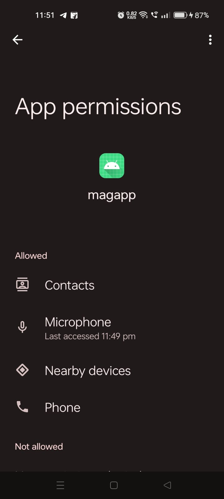
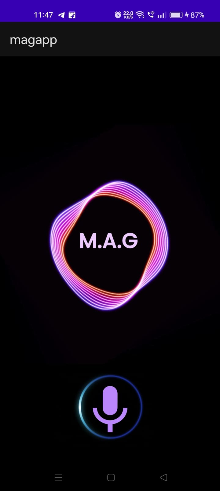
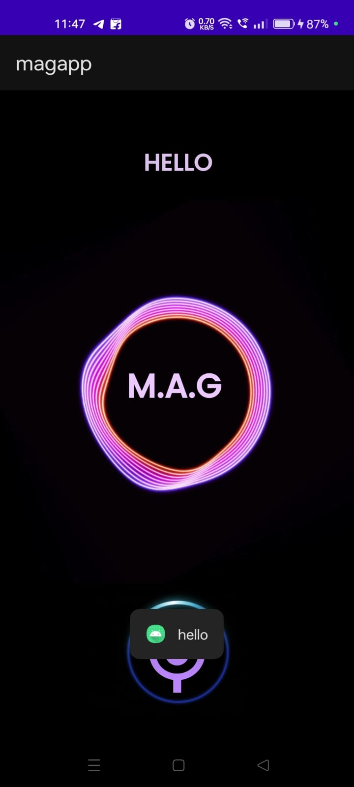
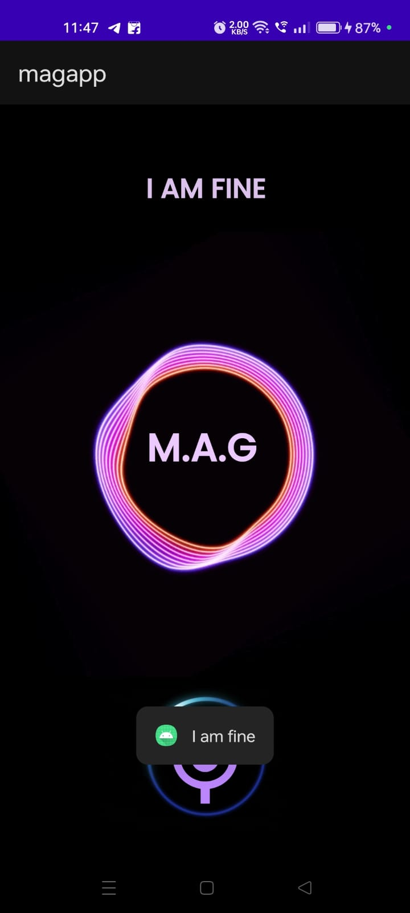
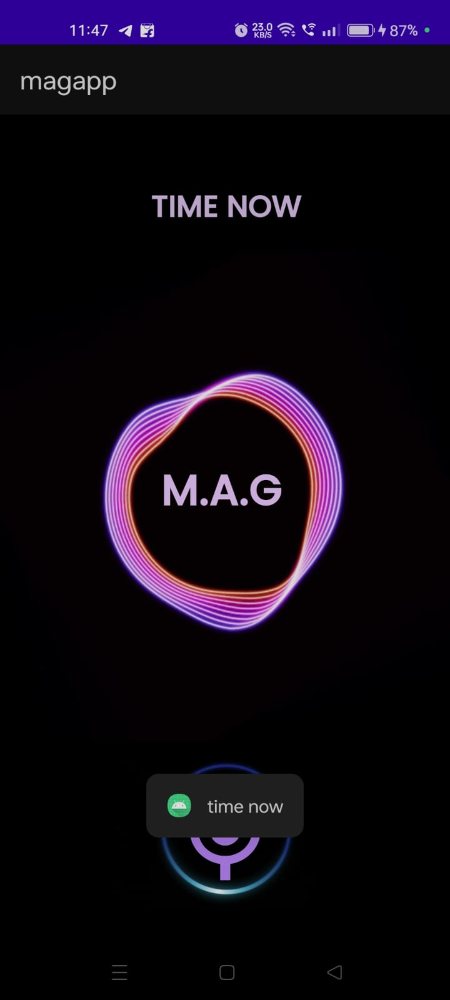
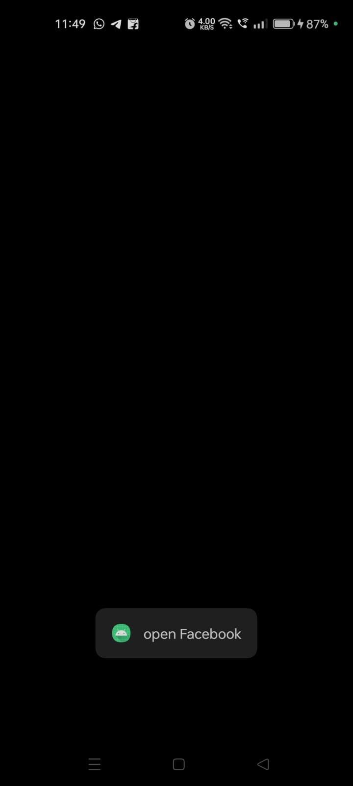
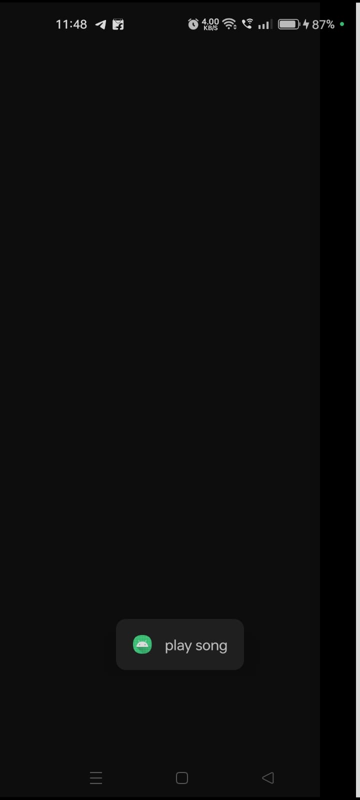
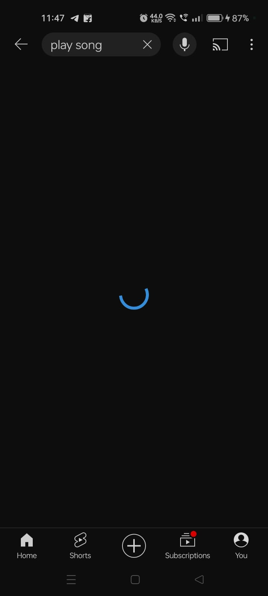

# M.A.G - The Voice Assistant

Welcome to M.A.G - The Voice Assistant, your personal Android app companion that assists you with a variety of tasks using voice commands. This app is designed to make your daily activities easier and more convenient. Please follow the guide below to get started and make the most out of M.A.G.

## Features:

- **Natural Language Understanding:** M.A.G understands a wide range of natural language commands, allowing you to interact with it in a conversational manner.

- **Multi-functional Commands:** Ask M.A.G about the weather, play your favorite music, inquire about the time, get answers to general knowledge questions, and much more.

- **User-Friendly Interface:** The app is designed with a clean and intuitive interface, ensuring a seamless user experience.

- **Permissions:** To enable full functionality, make sure to grant all necessary permissions from your device settings.

- **Security:** Although M.A.G may prompt warnings about viruses, rest assured that the app is safe. This is a common occurrence with voice assistant apps due to the nature of voice recognition.

## Getting Started:

1. **Permissions:** Navigate to your device settings and grant all the required permissions for M.A.G to function properly.

  
   
   

3. **Installation:** Download and install M.A.G from the Google Play Store or your preferred app store.

4. **Launching the App:** Open the app and grant any additional permissions required within the app.

   
5. **Command Examples:**
   - "How are you?"
   - "What is the weather like today?"
   - "Where is the nearest coffee shop?"
   - "Play my favorite music."
   - "What time is it?"
   - "What is your name? What does it mean?"
   - "Open facebook? or any app on mobile"

   
   
   
    
  
   
   
   
   
  
    
   
    
   
  
 
   
 
7. Enjoy Your Assistant:Start using M.A.G for a hands-free and efficient experience in your daily tasks.

## Troubleshooting:

- If the app doesn't respond, ensure that your microphone is enabled, and you are in a quiet environment.

- In case of any issues, check for app updates on the Play Store.

## Note:

M.A.G is developed in Java for Android devices. Your feedback is valuable for future improvements. If you encounter any issues or have suggestions, please contact us through the app or visit our website.

Thank you for choosing M.A.G - The Voice Assistant!
